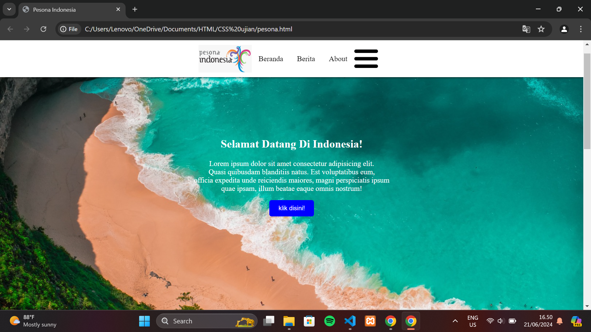
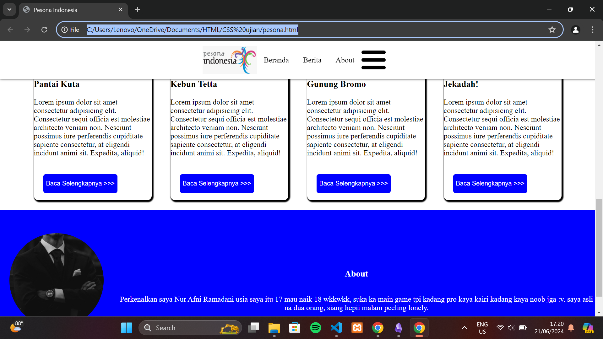

# kode program
## HTML
```html
<!DOCTYPE html>
<html>
<head>
    <title>Pesona Indonesia</title>
    <meta name="viewport" content="width=device-width, initial-scale=1.0">
    <link rel="stylesheet" href="pesona.css">
</head>
<body>
    <nav class="navbar">
        
        <p>Beranda</p>
        <p>Berita</p>
        <p>About</p>
        
    </nav>
  <div class="background">
        <div class="tex">
            <h2>Selamat Datang Di Indonesia!</h2>
            <p>Lorem ipsum dolor sit amet consectetur adipisicing elit. <br> Quasi quibusdam blanditiis natus.
                Est voluptatibus eum, <br> officia expedita unde reiciendis maiores,
                magni perspiciatis ipsum <br>quae ipsam, illum beatae eaque omnis nostrum!
            </p>
        <input class="button" type="button" value="klik disini!">
    </div>
    </div>
    <h2 align="center">Berita</h2>
    <div class="container">
        <div class="box">
            
            <h3>Pantai Kuta</h3>
            <p>Lorem ipsum dolor sit amet consectetur adipisicing elit. Consectetur sequi officia est molestiae
                architecto veniam non. Nesciunt possimus iure perferendis cupiditate sapiente consectetur,
                at eligendi incidunt animi sit. Expedita, aliquid!
            </p>
            <input class="tombol" type="button" value="Baca Selengkapnya >>>">
        </div>
        <div class="box">
            
            <h3>Kebun Tetta</h3>
            <p>Lorem ipsum dolor sit amet consectetur adipisicing elit. Consectetur sequi officia est molestiae
                architecto veniam non. Nesciunt possimus iure perferendis cupiditate sapiente consectetur,
                at eligendi incidunt animi sit. Expedita, aliquid!
            </p>
            <input class="tombol" type="button" value="Baca Selengkapnya >>>">
        </div>
        <div class="box">
        
            <h3>Gunung Bromo</h3>
            <p>Lorem ipsum dolor sit amet consectetur adipisicing elit. Consectetur sequi officia est molestiae
                architecto veniam non. Nesciunt possimus iure perferendis cupiditate sapiente consectetur,
                at eligendi incidunt animi sit. Expedita, aliquid!
            </p>
            <input class="tombol" type="button" value="Baca Selengkapnya >>>">
    </div>
        <div class="box">
            
            <h3>Jekadah!</h3>
            <p>Lorem ipsum dolor sit amet consectetur adipisicing elit. Consectetur sequi officia est molestiae
                architecto veniam non. Nesciunt possimus iure perferendis cupiditate sapiente consectetur,
                at eligendi incidunt animi sit. Expedita, aliquid!
            </p>
            <input class="tombol" type="button" value="Baca Selengkapnya >>>">
        </div>
    </div>
    <div class="end">
        
        <div class="text">
        <h3 id="jd">About</h3>
        <p>Perkenalkan saya Nur Afni Ramadani usia saya itu 17 mau naik 18 wkkwkk, suka ka main game
            tpi kadang pro kaya kairi kadang kaya noob jga :v. saya asli na dua orang, siang hepii malam peeling lonely.
        </p>
        </div>
    </div>
</body>
</html>
```
## CSS
```css
body {
      margin: 0;
      padding: 0;
  }

  .navbar {
      display: flex;
      position: fixed;
      margin-bottom: 500px;
      background-color: white;
      padding-right: 100%;
      justify-content: center;
      box-shadow: 0px 0px 5px 0px;
      z-index: 99;
  }

  .navbar > img.logo {
      width: auto;
      height: 60px;
      margin-left: 30px;
      margin-right: auto;
      padding-left: 400px;
      padding-top: 10px;
      padding-bottom: 10px;
      width: 115px;
  }

  .navbar p {
      padding: 15px;
      cursor: pointer;
      transition: 0.8s all;
  }

  .navbar p:hover {
      transform: scale(1.3);
  }

  .navbar p:active {
      transform: scale(0.8);
  }

  .navbar img.garis {
      margin-left: auto;
      padding-right: 30px;
      padding-top: 20px;
      padding-bottom: 10px;
      height: 40px;
  }

  @media only screen and (max-width: 768px) {
  .navbar {
      padding-right: 20px;
      }
      
  .navbar > img.logo {
      padding-left: 20px;
      }
  }

  .background {
      background-image: url('halaman.jpg');
      background-size: cover;
      padding-top: 100px;
      height: 600px;
      text-align: center;
      width:100%;
  }

  .button {
      background-color: blue;
      color: white;
      padding: 10px 20px;
      border-radius: 5px;
      cursor: pointer;
      border: none;
  }

  .button:hover {
      background-color: white;
      color: navy;
  }

  .tex {
      color: white;
      padding-top: 10%;
      padding-bottom: 20px;
  }

  .container {
      display: flex;
      flex-wrap: wrap;
      justify-content: center;
  }

  .box {
      border: 1px black;
      border-radius: 10px;
      box-shadow: 2px 2px 2px 2px;
      background-color: white;
      width: 250px;
      height: 450px;
      margin: 20px;
  }

  .gambar {
      margin-top: 20px;
      width: 220px;
      height: 150px;
      padding-left: 15px;
      border-radius: 30px;
  }

  .tombol {
      background-color: blue;
      color: white;
      margin: 20px;
      height: 40px;
      border: none;
      border-radius: 5px;
      cursor: pointer;
  }

  .tombol:hover {
      background-color: navy;
      color: white;
  }

  .end {
      background-color: blue;
      color: white;
      height: 300px;
      display: flex;
      align-items: center;
      text-align: center;
  }

  #border {
      width: 200px;
      height: 200px;
      border-radius: 100px;
      margin: 20px;
      filter: grayscale(100);
  }

  #jd {
      text-align: center;
  }

  .text {
      margin-top: 40px;
      margin-left: 10px;
      display: flex;
      flex-direction: column;
  }

  @media (max-width: 600px) {
  .end {
      flex-direction: column;
      height: auto;
  }

  #border {
      margin: 10px auto;
  }

  .text {
  margin-top: 20px;
  }
      }
```
### hasil



### analisis
#### HTML
- `<!DOCTYPE html>`: menunjukkan bahwa dokumen ini menggunakan HTML5.
- **`<html>`**: Elemen root dari dokumen HTML.
- **`<head>`**: Bagian ini berisi metadata dokumen, seperti judul, link ke stylesheet, dan informasi viewport.
- **`<title>`**: Menampilkan judul halaman pada tab browser.
- **`<meta name="viewport"`**: Mengatur tampilan halaman agar responsif terhadap berbagai ukuran layar.
- **`<link rel="stylesheet"`**: Menghubungkan dokumen HTML dengan file CSS eksternal bernama `pesona.css`.
- **`<nav>`**: Elemen navigasi yang berisi menu dan logo.
- **``**: Elemen gambar untuk logo dan ikon menu (garis tiga horizontal).
- **`<p>`**: Elemen paragraf yang digunakan sebagai item menu. Sebaiknya item menu ini menggunakan elemen `<a>` untuk navigasi yang lebih baik.
- **`<div class="background">`**: Div yang berfungsi sebagai latar belakang.
- **`<h2>`**: Judul selamat datang.
- **`<p>`**: Paragraf dengan beberapa tag `<br>` untuk pindah baris.
- **`<input class="button"`**: Tombol yang memiliki nilai "klik disini!".
- **`<h2 align="center">Berita</h2>`**: Judul bagian berita. Properti `align` pada elemen `<h2>` sudah deprecated, sebaiknya menggunakan CSS untuk mengatur perataan teks.
- **`<div class="container">`**: Kontainer untuk bagian berita.
- **`<div class="box">`**: Setiap kotak berita berisi gambar, judul, paragraf, dan tombol "Baca Selengkapnya".
- **`<div class="end">`**: Div untuk bagian akhir halaman yang berisi informasi tentang penulis.
- **``**: Div yang berisi teks deskripsi tentang penulis.
#### CSS
- Menghapus margin dan padding default dari elemen `<body>`, yang memastikan bahwa tidak ada ruang kosong di sekitar halaman.
- **`display: flex;`**: Menjadikan `.navbar` sebagai kontainer fleksibel.
- **`position: fixed;`**: Navbar tetap berada di atas halaman saat digulir.
- **`margin-bottom: 500px;`**: Pengaturan margin bawah yang terlalu besar, kemungkinan perlu diperiksa kembali.
- **`padding-right: 100%;`**: Tidak umum, sepertinya tidak sesuai.
- **`justify-content: center;`**: Mengatur item dalam navbar di tengah secara horizontal.
- **`box-shadow: 0px 0px 5px 0px;`**: Menambahkan bayangan halus di bawah navbar.
- **`z-index: 99;`**: Menempatkan navbar di atas elemen lain pada halaman.
- `padding-left: 400px;` dan `margin-right: auto;` tampaknya tidak diperlukan dan dapat menyebabkan masalah tampilan, terutama pada layar kecil.
- Memberikan efek hover dan active pada elemen `<p>` dalam navbar untuk memperbesar dan memperkecil teks.
- Mengatur tampilan ikon `"garis tiga"` pada navbar.
- Mengatur ulang padding pada navbar untuk layar dengan lebar maksimal 768px agar lebih sesuai pada perangkat yang lebih kecil.
- Mengatur gambar latar belakang agar menutupi seluruh elemen dengan padding di atas 100px.
- Mengatur gaya tombol dengan efek hover untuk mengubah warna latar dan teks.
- Mengatur warna teks dan padding atas dan bawah dalam elemen `.tex`.
- **`.container`**: Menggunakan flexbox untuk menyusun elemen `.box`.
- **`.box`**: Mengatur gaya kotak dengan bayangan, border radius, dan margin.
- Menentukan ukuran dan radius border untuk gambar dalam kotak.
- Mengatur gaya tombol dalam kotak berita dengan efek hover.
- Mengatur gaya untuk bagian akhir halaman dengan gambar profil dan teks deskripsi.
- Mengatur ulang tata letak bagian akhir halaman untuk layar dengan lebar maksimal 600px agar lebih sesuai pada perangkat yang lebih kecil.